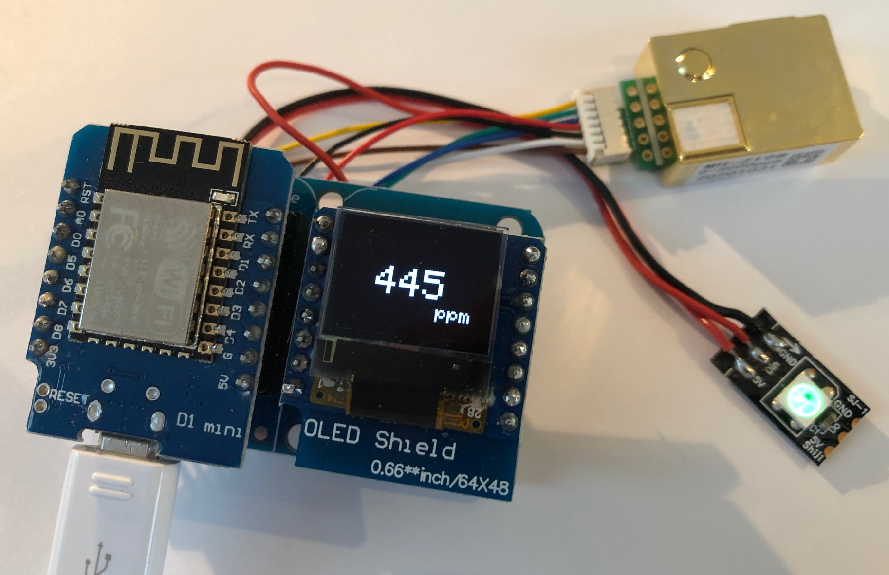
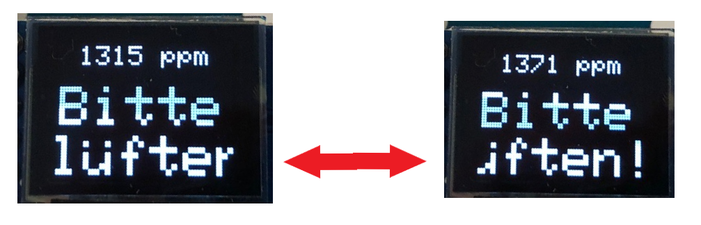

# CO2-Sensor with Display and Traffic Light - ESP8266
 
A simple CO2-Meter based on Wemos D1 mini, MH-Z19B CO2-Sensor, OLED-Display-Shield 64x48, Neopixel LED  
A first try to get familiar with some of the parts.  
See https://github.com/chrisweather/Office-Climate-Control for the final result.

 
    Set 'Adafruit_SSD1306.h' to these settings:
    
    #define SSD1306_I2C_ADDRESS   0x3C  // 011110+SA0+RW - 0x3C or 0x3D
    
    // #define SSD1306_64_48
    #define SSD1306_128_64
    //   #define SSD1306_128_32
    //   #define SSD1306_96_16

 

 

The text scrolls left<->right if it's longer than the display.
 
